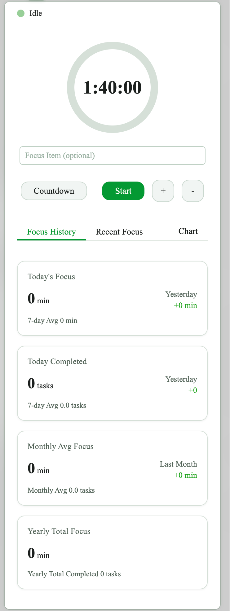
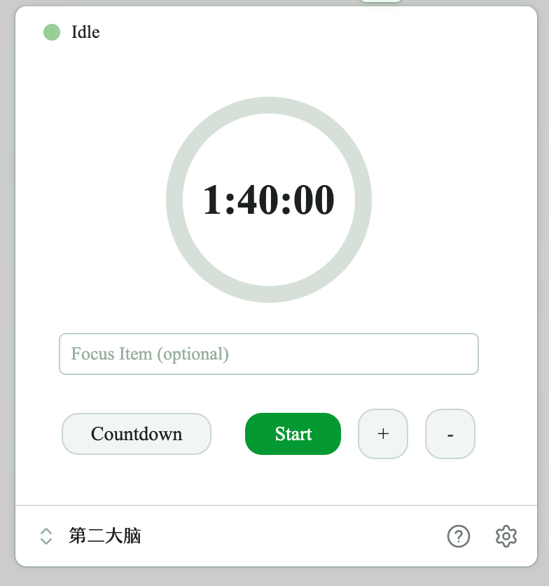
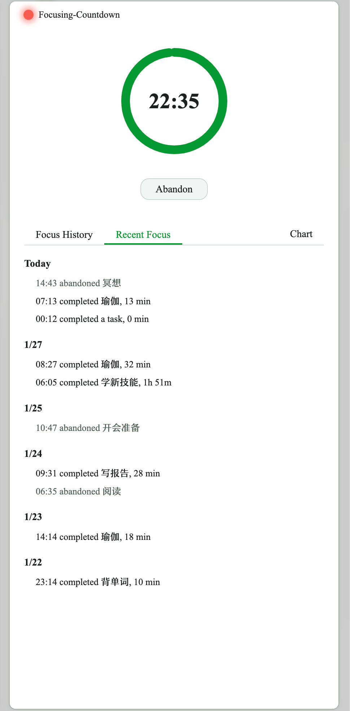
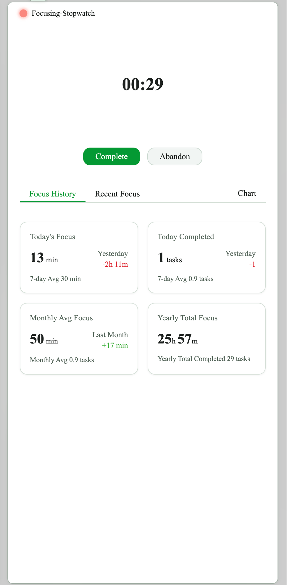
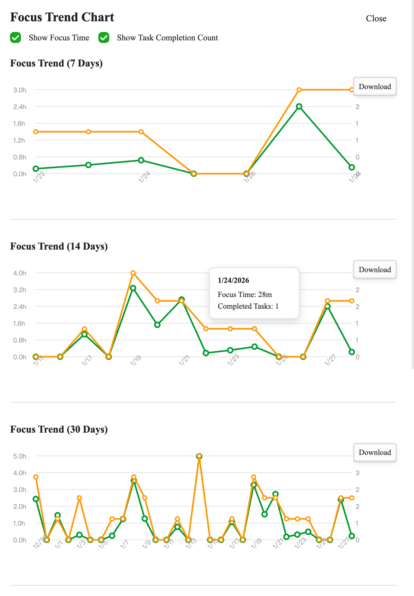
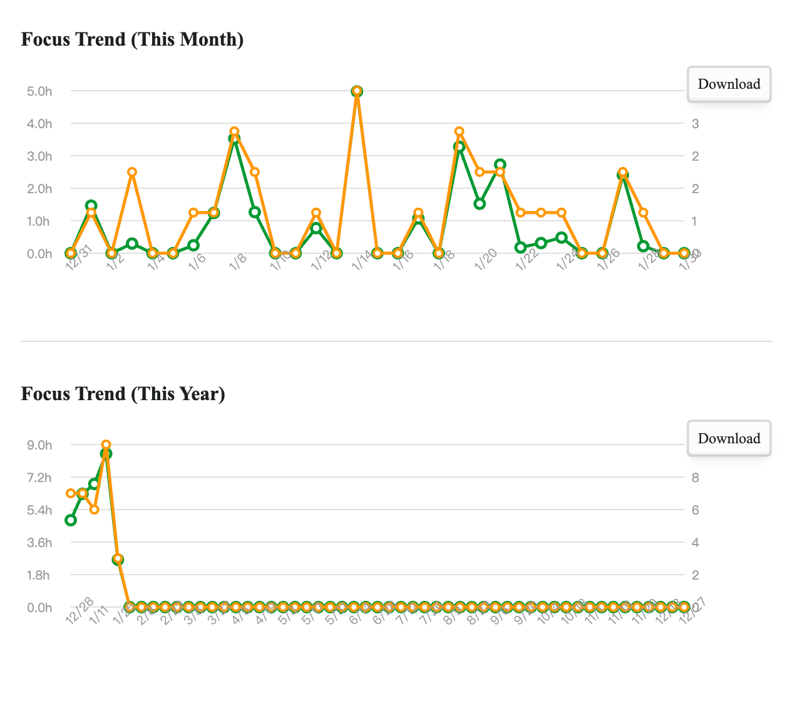
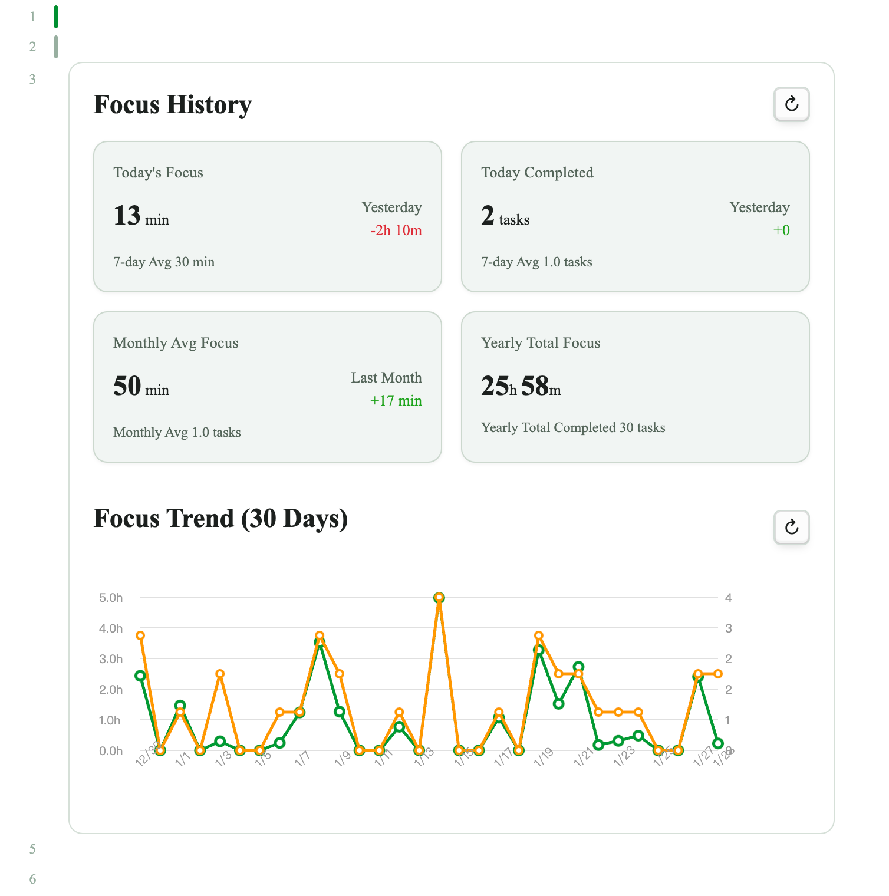
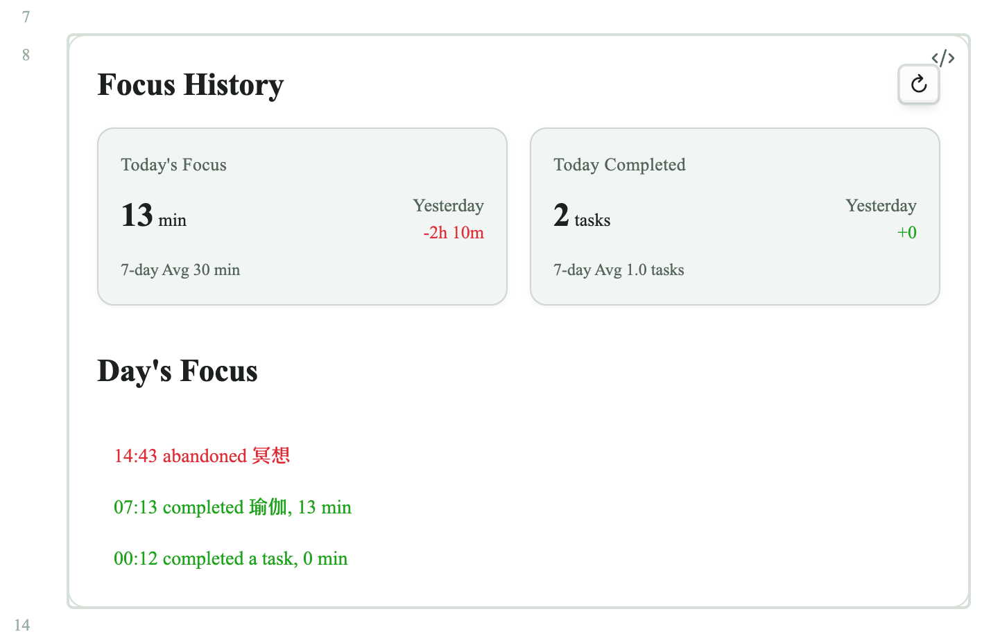
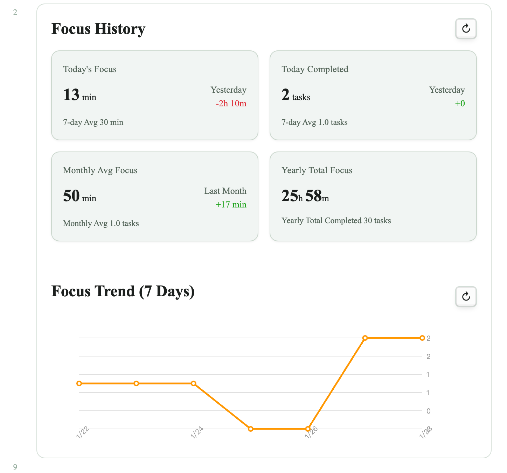
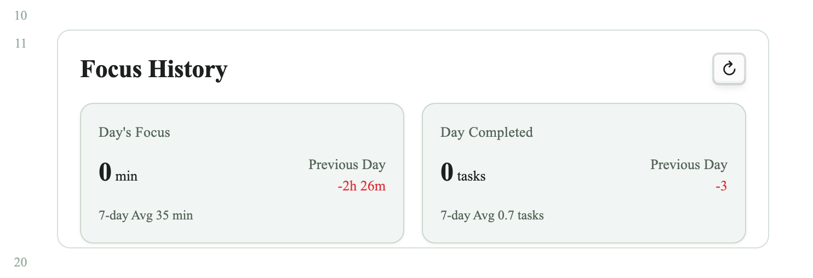

# Focus Timer 插件 - 用户指南

> **致各位用户**：感谢大家对 Focus Timer 的支持与喜爱！本插件目前仍在稳步更新中，部分功能可能存在不稳定或后续调整的情况，感谢大家的理解与耐心。如有问题或建议，欢迎通过下方链接反馈。

一个专为 Obsidian 设计的本地专注计时器插件，支持统计分析、卡片视图和在笔记中嵌入数据展示。

## 快速开始

**打开计时器**：点击左侧边栏图标 / 底部状态栏 / 命令面板 `Open Focus Timer View`

**开始专注**：
1. 输入任务名称（可选，最多 100 个英文字符或 50 个中文字符）
2. 选择模式：**倒计时**（默认25分钟）或 **正计时**
3. 使用 +/- 按钮调整或点击时间设置专注时长
4. 点击"开始"或按回车键（如果启用键盘快捷键）

**结束会话**：
- **完成**：标记为已完成并保存记录
- **放弃**：标记为已放弃并保存记录
- 倒计时结束后可启动休息时段

窗口较窄或较小时，面板会自动适配布局：





## 计时器模式

| 模式 | 说明 | 特性 |
|------|------|------|
| **倒计时** | 设定特定时长倒数 | 可自动切换为正计时 / 启动休息时段 |
| **正计时** | 从零开始计时 | 无预设时长，可暂停/恢复 |

**倒计时**



**正计时**



## 命令

通过命令面板（`Cmd/Ctrl + P`）访问：

- `Start Focus (25m/50m)` - 快速启动计时器
- `Stop Focus (Complete)` - 完成当前会话
- `Abandon Focus` - 放弃当前会话
- `Open Focus Timer View` - 打开计时器面板
- `Start Quick Timer 1/2/3` - 启动预设快捷计时器

## 统计与视图

**专注历史**：卡片式布局查看所有会话，可按日期筛选  
**统计指标**：今日专注时长 / 完成任务数 / 7天平均 / 月度平均 / 年度总计  
**图表**：可视化专注数据（7天/14天/30天/本月/本年），支持时长和任务数量双指标





## 在笔记中嵌入

使用代码块在笔记中嵌入专注计时器数据和图表。

### 基础语法

````markdown
```focus
```
````

显示今日专注统计，默认统计图表。



````markdown
```focus
date: today
```
````

显示今日专注统计，今日专注事项列表。



带图表参数与自定义高度的示例：



### 配置参数

| 参数 | 说明 | 可选值 | 
|------|------|--------|
| `date` | 指定日期 | `today`, `yesterday`, `2026-01-20`（具体日期） |
| `chart` | 图表展示范围（适用于不带date参数） | `7`, `14`, `30`, `month`, `year`, `none` |
| `chart` | 图表展示范围+指标（适用于不带date参数） | `30 time`, `30 task`（第一个参数选择上行所示参数，第二个参数在time和task中选择，如果不填写则专注时间和完成任务数量都显示） |
| `record` | 隐藏记录（带不带date参数均适用） | `none` （不指定时默认显示） |
| `items` | 隐藏专注事项列表（适用于带date参数） | `none`（不指定时默认显示） |
| `height` | 自定义高度（像素）（带不带date参数均适用） | `300`, `500` ...|

### 示例

````markdown
```focus
chart: 7 task
height: 800
```
````

显示今日专注统计，和7天任务完成数量统计图表，并限制显示框高度为800px。

````markdown
```focus
date: 2026-01-01
items: none
height: 200
```
````

只显示当日统计（不显示专注事项列表），并限制显示框高度为200px。



## 使用技巧

- **任务建议**：插件会记住最近的任务并在输入时提示
- **快捷访问**：使用边栏图标、状态栏或快捷键
- **快捷计时器**：设置常用的计时器为快捷计时器 1/2/3
- **番茄工作法**：启用自动休息功能
- **嵌入到处**：在日记、项目页面或回顾文档中添加 focus 代码块

## 支持

- **帮助**: https://tianyezhou.com/focus-timer
- **作者**: Tianye Zhou (https://tianyezhou.com)

---

*注意：此插件仅支持桌面端，需要 Obsidian 1.4.5 或更高版本。*
